<div align="center">

[📷 dbidding 메인 로고 이미지]

# dbidding

### 포켓몬 카드를 실시간으로 거래하는 온라인 경매 플랫폼

실시간 입찰부터 카드 등록, 시세 확인, 알림까지  
포켓몬 카드 거래 경험을 하나의 서비스에서 제공합니다.

<br/>

[서비스 바로가기](https://dbidding.shop)
&nbsp; | &nbsp;
[GitHub Wiki](https://github.com/softeerbootcamp-8th/WEB-TEAM2-2gether/wiki)
&nbsp; | &nbsp;
[API 문서](API_DOCUMENT_URL)
&nbsp; | &nbsp;
[Figma](FIGMA_URL)

</div>

<br/>

---

## 📋 목차

1. [서비스 소개](#1-서비스-소개)
2. [핵심 기능](#2-핵심-기능)
3. [기술 스택](#3-기술-스택)
4. [시스템 아키텍처](#4-시스템-아키텍처)
5. [ERD](#5-erd)
6. [기술적 도전](#6-기술적-도전)
7. [성능 개선](#7-성능-개선)
8. [프로젝트 문서](#8-프로젝트-문서)
9. [팀 소개](#9-팀-소개)

<br/>

---

# 1. 서비스 소개

## 포켓몬 카드 거래를 실시간 경매로

포켓몬 카드 거래에서는 판매자가 적절한 판매 가격을 판단하기 어렵고,
구매자는 원하는 카드의 매물과 거래 가격을 여러 곳에서 직접 찾아야 하는 불편이 있습니다.

**dbidding**은 포켓몬 카드에 특화된 실시간 경매 서비스를 통해
구매자와 판매자가 시장의 수요에 따라 가격을 결정할 수 있도록 설계했습니다.

### 우리가 해결하고자 한 문제

- 카드의 적절한 판매 가격을 판단하기 어렵습니다.
- 구매자가 카드의 시세와 매물을 한눈에 확인하기 어렵습니다.
- 기존 중고 거래는 가격 협상이 비동기적으로 이루어집니다.
- 인기 경매에서는 다수 사용자의 동시 입찰을 정확하게 처리해야 합니다.
- 입찰 결과와 경매 상태를 사용자에게 실시간으로 전달해야 합니다.
- 경매 보증금으로는 구매 거부/판매 거부에 대한 패널티 강도가 낮아 가짜 입찰을 막기 어렵습니다.

### dbidding이 제공하는 경험

- 실시간 경매를 통한 시장 기반 가격 형성
- 카드 시세와 경매 정보를 한 곳에서 조회
- 동시 입찰 상황에서도 정확한 입찰 처리
- 입찰 결과와 사용자 상태의 실시간 반영
- 경매 등록부터 낙찰까지 이어지는 하나의 거래 흐름
- 이미 결제된 포인트로 안전한 거래 가능

<br/>

[📷 서비스 메인 페이지 또는 대표 화면 이미지]

<br/>

---

# 2. 핵심 기능

## 경매 등록

판매자는 보유한 포켓몬 카드를 등록하고
경매 조건을 설정해 판매를 시작할 수 있습니다.

- 카드 정보 선택 및 등록
- 카드 이미지 등록
- 경매 시작 가격 설정
- 즉시 구매 가격 설정
- 경매 종료 시간 설정

<br/>

[📷 경매 등록 화면 GIF 또는 Screenshot]

<br/>

---

## 경매 입찰

사용자는 진행 중인 경매에 실시간으로 참여할 수 있습니다.

- 현재 최고 입찰가 기준 최소 입찰 금액 검증
- Wallet 잔액 검증
- 동시 입찰 처리
- 최고 입찰자 및 최고 입찰가 변경
- 입찰 성공 / 실패 결과 즉시 반환

<br/>

[📷 두 사용자가 동시에 입찰하는 화면 GIF]

<br/>

---

## 실시간 경매 현황 조회

경매 진행 상태와 현재 가격을 실시간으로 확인할 수 있습니다.

- 현재 최고 입찰가
- 최고 입찰자 상태
- 남은 경매 시간
- 경매 종료 상태
- 입찰에 따른 가격 변화 실시간 반영

<br/>

[📷 경매 상세 화면에서 가격이 실시간 변경되는 GIF]

<br/>

---

## 실시간 알림

경매 및 사용자 상태 변화를 SSE를 통해 실시간으로 전달합니다.

- 상위 입찰 발생 알림
- 낙찰 결과 알림
- 경매 상태 변경
- Wallet 상태 변경
- 개인화 알림

<br/>

[📷 알림 UI 또는 SSE 동작 GIF]

<br/>

---

## 카드 시세 조회

카드별 거래 정보를 기반으로
구매자와 판매자가 현재 시장 가격을 확인할 수 있도록 합니다.

- 카드별 거래 가격 조회
- 카드 상세 정보 제공
- 경매 가격 비교
- 시세 탐색

<br/>

[📷 카드 시세 조회 화면]

<br/>

---

# 3. 기술 스택

## Frontend

<p>
  [Frontend 기술 배지]
</p>

## Backend

<p>
  
  
  
  
</p>

## Data

<p>
  
  
</p>

## Infrastructure

<p>
  
  
  
  
  
</p>

## Monitoring / Test

<p>
  
  
  
  
</p>

<br/>

---

# 4. 시스템 아키텍처

[📷 최종 시스템 아키텍처 이미지]

> 포함 요소 예시  
> Client / CloudFront / S3 / Nginx / Backend / Redis / MySQL / Prometheus / Grafana

<br/>

### 주요 처리 흐름

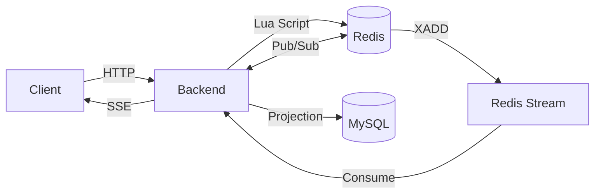

Redis는 실시간 입찰 처리와 이벤트 전달을 담당하고,
MySQL은 비동기 Projection을 통해 영속 데이터를 유지합니다.

[👉 Architecture Wiki](https://github.com/softeerbootcamp-8th/WEB-TEAM2-2gether/wiki/Architecture-%EC%A0%84%EC%B2%B4-%EC%8B%9C%EC%8A%A4%ED%85%9C-%EC%95%84%ED%82%A4%ED%85%8D%EC%B2%98)

<br/>

---

# 5. ERD

[📷 최종 ERD 이미지] (https://github.com/user-attachments/assets/feaa7e80-16a9-47b3-9c75-b96b57c60727)

주요 도메인은 다음과 같이 구성됩니다.

- Account
- Auction
- Bid
- Card
- Wallet
- Notification
- Order
- Timeline / Projection 관련 데이터

[👉 ERD 상세 보기](https://github.com/softeerbootcamp-8th/WEB-TEAM2-2gether/wiki/%5BERD%5D-%EB%AC%BC%EB%A6%ACERD)

<br/>

---

# 6. 기술적 도전

## Redis Lua — 메모리 기반 원자적 입찰 처리

초기에는 MySQL Transaction과 비관적 Lock을 이용해
입찰 정합성을 보장했습니다.

하지만 특정 경매에 입찰이 집중되면 동일 Row Lock을 기다리는 요청이 증가하고,
DB Connection이 장시간 점유되는 구조적 병목이 발생했습니다.

이를 해결하기 위해 실시간 입찰 승인 경로를 Redis로 이동하고,
하나의 Lua Script 안에서 검증과 상태 변경을 처리했습니다.

```text
입찰 요청
  ↓
Redis Lua
  ├─ 경매 상태 확인
  ├─ 현재 가격 검증
  ├─ Wallet 검증
  ├─ Wallet Hold 변경
  ├─ 최고 입찰가 변경
  └─ Redis Stream XADD
```

Redis의 단일 Thread 실행 모델과 Lua Script의 원자성을 이용해
별도의 DB Row Lock 없이 입찰 상태를 일관되게 변경합니다.

<br/>

[👉 Redis Lua Wiki](https://github.com/softeerbootcamp-8th/WEB-TEAM2-2gether/wiki/%EC%8B%A4%EC%8B%9C%EA%B0%84-%EA%B2%BD%EB%A7%A4-%EC%8B%9C%EC%8A%A4%ED%85%9C-Redis-Lua-%EA%B8%B0%EB%B0%98-%EC%9B%90%EC%9E%90%EC%A0%81-%EC%9E%85%EC%B0%B0)

<br/>

---

## Redis 정책

저희는 Redis를 단순 Cache가 아니라 입찰 승인 과정에서 필요한 실시간 상태를 보관하는 핵심 저장소이자 입찰과 포인트 충전 등을 포함한 비즈니스 로직을 처리하는 연산 처리를 위해 사용하고 있습니다.

따라서 메모리가 부족해졌을 때 기존 Key가 임의로 제거되는 정책은 입찰 상태 정합성에 직접적인 영향을 줄 수 있습니다. 이에 따라 데이터 유실을 방지하고 상태 정합성을 보장하기 위해 `noeviction` 정책을 채택했습니다.

하지만 `noeviction` 설정과 제한된 1GB 메모리 환경에서는 모든 데이터를 상시 적재할 경우 메모리 한계에 도달하여 신규 Write가 실패하는 장애가 발생할 수 있습니다. 

이를 해결하기 위해 **On-Demand 방식**을 선택했습니다. 모든 경매 데이터를 미리 올려두지 않고, 실제 입찰 요청이나 경매가 활성화되는 시점에 필요한 데이터만 선별적으로 적재 및 관리함으로써 1GB 메모리 내에서 안전하고 예측 가능하게 운영되도록 설계했습니다.

Redis flow chart

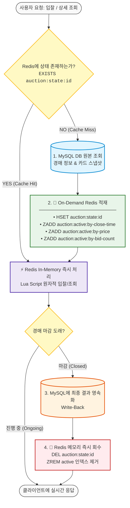

[👉 Redis 상태 관리 Wiki](https://github.com/softeerbootcamp-8th/WEB-TEAM2-2gether/wiki/5.5-Redis-%EB%B9%84%EC%96%B4-%EC%9E%88%EC%9D%84-%EB%95%8C-%EC%83%81%ED%83%9C-%EB%B3%B5%EC%9B%90-&-Redis-%EC%83%81%ED%83%9C-%EC%82%AC%EC%A0%84-%EC%A0%81%EC%9E%AC)
[👉 Redis TTL Wiki](https://github.com/softeerbootcamp-8th/WEB-TEAM2-2gether/wiki/5.7-TTL-%EC%A0%95%EC%B1%85)

<br/>

---

## Redis Stream — Redis와 DB 간 Projection

입찰 승인 과정에서 Redis와 MySQL을 동시에 동기적으로 변경하면, DB Write(락 경합 및 I/O 지연)가 다시 실시간 요청 경로의 병목이 됩니다.

이를 해결하기 위해 **Redis Lua Script 안에서 입찰 승인과 동시에 이벤트를 Redis Stream에 원자적으로 기록(`XADD`)**하고, 
단일 Consumer가 MySQL에 비동기로 반영(Projection)합니다.

```text
Redis Lua (원자적 승인 & XADD)
   ↓
Redis Stream (event:timeline)
   ↓
Single Consumer (Leader Lock 기반)
   ↓
DB Inbox (PENDING 적재 & ACK/XDEL)
   ↓
MySQL Domain Projection (트랜잭션 순차 반영)
   ↓
DB Inbox (PROCESSED 완료)
```

이를 통해 실시간 승인 처리(수 ms 응답)와 무거운 영속화 작업을 완전히 분리했습니다. 

또한 DB에 일시적인 지연이나 장애가 발생하더라도 Redis Stream이 완충 버퍼 역할을 하여
데이터 유실 없이 순차적으로 따라잡을(Catch-up) 수 있으며, 
투영 오류 발생 시 **Transactional Inbox에 영속화된 원본 이벤트를 기반으로 안전하게 재처리(Replay)**할 수 있도록 설계했습니다.

[👉 Redis-Mysql Projection Wiki](https://github.com/softeerbootcamp-8th/WEB-TEAM2-2gether/wiki/%EC%8B%A4%EC%8B%9C%EA%B0%84-%EA%B2%BD%EB%A7%A4-%EC%8B%9C%EC%8A%A4%ED%85%9C-Redis-Stream-%EA%B8%B0%EB%B0%98-%EB%8D%B0%EC%9D%B4%ED%84%B0-%EC%98%81%EC%86%8D%ED%99%94)

<br/>

---

## Event 기반 비동기 아키텍처 — ThreadPoolExecutor / Virtual Thread

실시간 서비스에서는 입찰 처리뿐 아니라
SSE Broadcast, 알림 전달, 비동기 후처리 등 다양한 작업이 동시에 발생합니다.

초기에는 고정 Thread Pool 기반 Executor를 사용했지만,
부하 테스트에서 Executor Queue 포화와 작업 지연을 확인했습니다.

작업 특성에 따라 다음과 같이 실행 모델을 비교하고 적용했습니다.

- `ThreadPoolExecutor`
  - 동시 실행 수 제어
  - Queue를 통한 Backpressure
  - 제한된 Resource 환경에서 안정적인 처리

- Virtual Thread
  - 장시간 대기하는 I/O 작업의 Thread 비용 감소
  - SSE / 비동기 작업에서 실행 모델 비교
  - 부하 테스트를 통한 적용 효과 검증

<br/>

[📷 ThreadPoolExecutor vs Virtual Thread 구조 비교 이미지]

[👉 비동기 Executor Wiki](https://github.com/softeerbootcamp-8th/WEB-TEAM2-2gether/wiki/%EC%8B%A4%EC%8B%9C%EA%B0%84-%ED%86%B5%EC%8B%A0-SSE-Executor-%EA%B5%AC%EC%A1%B0)
[👉 가상스레드 Wiki](https://github.com/softeerbootcamp-8th/WEB-TEAM2-2gether/wiki/%EC%8B%A4%EC%8B%9C%EA%B0%84-%ED%86%B5%EC%8B%A0-Virtual-Thread%EC%99%80-%EB%8F%99%EC%8B%9C%EC%84%B1-%EC%A0%9C%ED%95%9C)
<br/>

---

## Redis Pub/Sub — Multi-instance SSE 실시간 전파

SSE 연결 객체는 각 Backend Instance의 Local Memory에 존재합니다.

따라서 Instance A에서 발생한 이벤트를
Instance B에 연결된 사용자에게 전달하려면 Instance 간 이벤트 전파가 필요합니다.

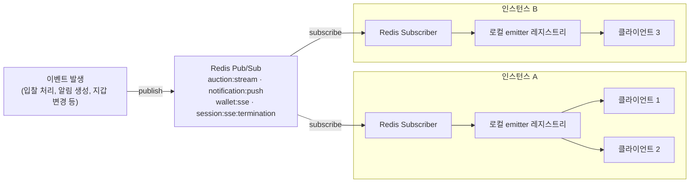


Redis Pub/Sub을 통해 모든 Backend Instance에 이벤트를 전달하고,
각 Instance는 자신이 보유한 `SseEmitter`에만 이벤트를 전달합니다.

<br/>

[👉 다중인스턴스 릴레이 Wiki](https://github.com/softeerbootcamp-8th/WEB-TEAM2-2gether/wiki/%EC%8B%A4%EC%8B%9C%EA%B0%84-%ED%86%B5%EC%8B%A0-%EB%A9%80%ED%8B%B0-%EC%9D%B8%EC%8A%A4%ED%84%B4%EC%8A%A4-%EB%A6%B4%EB%A0%88%EC%9D%B4-Redis-Pub-Sub)

<br/>

---

# 7. 성능 개선

1차부터 9차까지 부하 테스트를 반복하며
단순 최대 QPS 측정보다 **병목이 처음 발생하는 지점과 원인을 찾는 것**에 집중했습니다.

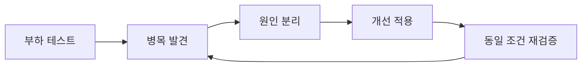

## SSE Fan-out — 전체 Broadcast → 선택 구독

### 문제

실시간 이벤트를 모든 SSE 연결에 broadcast하면서, fan-out 작업량이 연결 수에 비례해 늘었습니다.
전용 Executor로 요청 처리와 전송 책임을 분리한 뒤에도, "관심 없는 경매의 이벤트까지 받는" 구조 자체는 남아 있었습니다.

### 개선

- 공개 경매 SSE를 `auctionIds` 쿼리 기반 선택 구독으로 전환 (연결당 최대 16개)
- 지갑 잔액/홀드 변화는 경매 구독 여부와 무관하게 별도 개인화 SSE로 전달
- 전용 Executor 도입으로 SSE 전송과 요청 처리 스레드를 분리

같은 500 VU 조건에서 Executor 도입 전후로 k6 p95가 8.0s → 789ms, SSE 처리량이 261/s → 1,475/s로 개선됐습니다.

<br/>

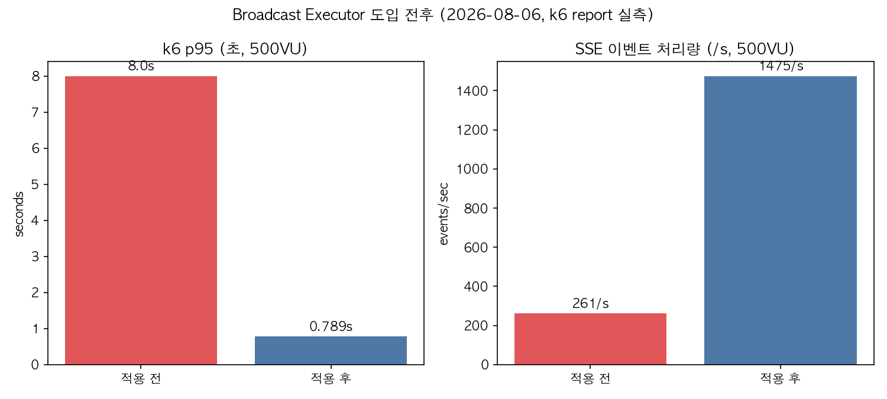

---

## 입찰 처리 — DB 비관적 Lock → Redis Lua

### Before

```text
입찰
 ↓
MySQL Transaction
 ↓
SELECT ... FOR UPDATE
 ↓
Lock Wait
 ↓
DB Connection 점유
```

### After

```text
입찰
 ↓
Redis Lua (bid-accept.lua)
 ↓
메모리 기반 원자적 승인
 ↓
Redis Stream
 ↓
비동기 DB Projection
```

같은 Hot Auction 시나리오로 전환 전/후를 비교했습니다.

| 지표 | Before (DB Lock 기반) | After (Redis Lua 기반) |
|---|---:|---:|
| Hot Auction p95 | 52,506ms | 90~140ms |
| Hot Auction max | 60,037ms (클라이언트 타임아웃) | 9,674ms |
| Hikari active 최댓값 | 30/30 (전 시나리오 포화) | 10/30 이하 |
| http_req_failed (핫경매) | 6.29% | 0.00% |

입찰 승인 경로에 MySQL이 아예 관여하지 않게 되면서, Row Lock 경쟁과 그로 인한 Connection Pool 고갈이 같이 사라졌습니다.

<br/>

| Before (8차, DB Lock) | After (9차, Redis Lua) |
|---|---|
| 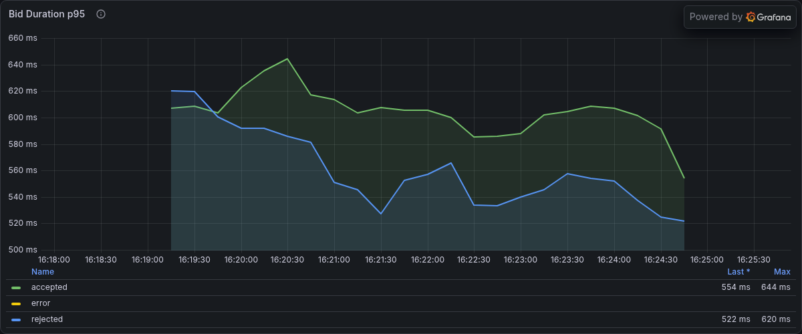 | 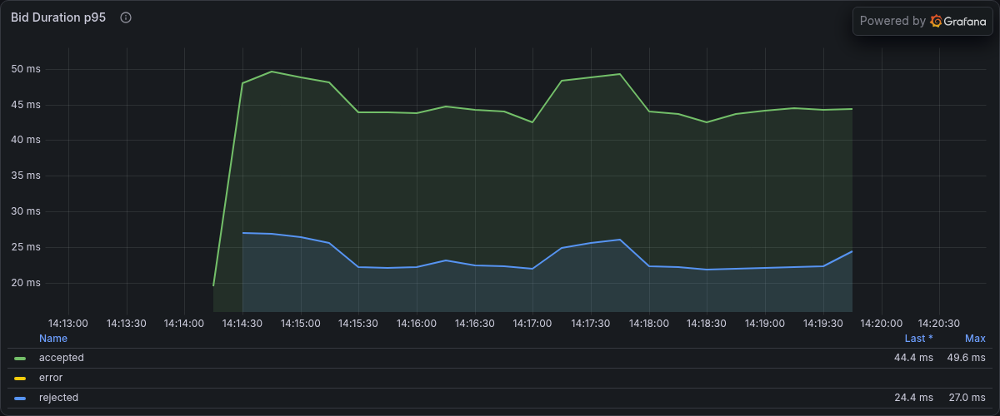 |
| 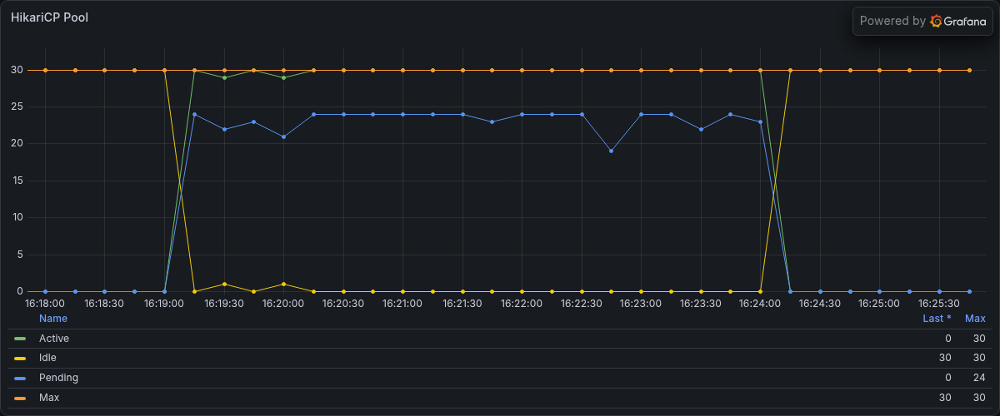 | 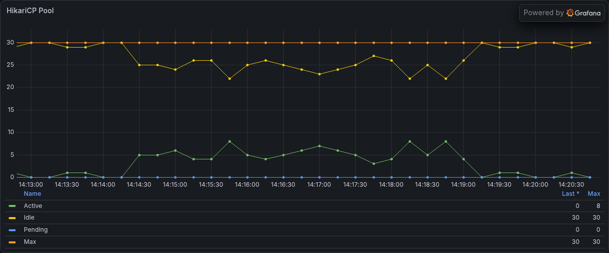 |

---

## 목록 조회 중복 제거 — 항목별 재조회 → 목록 전용 경량 조회

### 문제

경매 목록 조회 시 항목 하나당 상세/bid-context급 전체 조회를 재사용해서, 실제 쓰지도 않는 최근 입찰 내역까지 매번 다시 읽었습니다. 필터 없는 검색에서도 정렬용 후보를 항상 고정 배치(50개)만큼 읽었습니다. size=20·필터 없음 기준 요청 1번당 Redis 왕복이 약 110회였습니다.

### 개선

- 목록 전용 경량 조회(HGETALL 1회)를 새로 만들어 항목별 중복 재조회 제거
- 필터가 없을 때는 조회 배치 크기를 `limit`만큼만 읽도록 축소

요청 1번당 Redis 왕복이 약 110회 → 약 40회로 줄었고, 목록 조회 p95가 약 1,100~1,400ms → 220~630ms로 내려왔습니다.

<br/>

| Before (#529 수정 전) | After (#529 수정 후, 9차) |
|---|---|
| 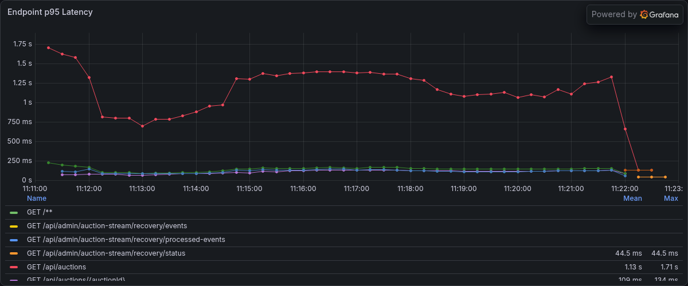 | 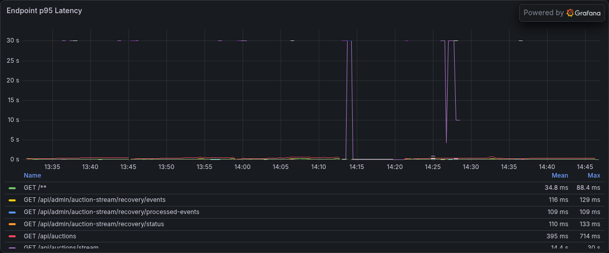 |

---

## Cold Seed N+1 — 개별 조회 → Batch Coordinator

### 문제

Redis Cache Miss(재시작·장애 직후) 시 필요한 Auction마다 개별 DB 조회가 발생해, 여러 경매가 동시에 Cold Miss 나면 N+1 형태로 DB 접근이 몰릴 수 있는 구조였습니다.

### 개선

짧은 시간(약 5ms Window, 최대 200건) 동안 Cold Seed 요청을 모아 한 번의 Batch Query로 처리하는 Coordinator를 도입했습니다.

```text
Cold Miss 요청들
  ↓
Seed Coordinator (짧은 Window 동안 수집)
  ↓
Batch DB Query
  ↓
Redis Seed → 각 요청에 결과 반환
```

> 이 항목은 부하 테스트로 단독 격리한 before/after 수치는 없고, 설계·구현 검증으로 확인했습니다.

---

## JVM Memory / Swap / GC — RAM 증설과 Virtual Thread 실험

물리 RAM 903MB 환경에서 GC pause와 Swap Thrashing이 겹치는 패턴을 확인했습니다. Virtual Thread를 먼저 시도했지만, 실제로 더 크게 작용한 변수는 RAM 부족이었습니다.

| Round | RAM | 1000-tier 실패율 | Full GC |
|---|---:|---:|---:|
| 5차 (Virtual Thread 미적용) | 903MB | 82.68~98.38% | 다수, OOM 2/3회 |
| 7차 (Virtual Thread 적용) | 903MB | 42.27% | 4회 |
| 8차 (RAM 증설) | 1.8GiB | 9.30% | 0회 |

RAM 증설 이후에도 Hot Auction 지연은 그대로 남아 있었습니다 — JVM/OS 메모리 안정화와 DB Row Lock 문제는 서로 다른 축이었고, 후자는 위 "입찰 처리" 절의 Redis 전환으로 풀었습니다.

<br/>

| 5차 (VT 미적용, 903MB) | 7차 (VT 적용, 903MB) | 8차 (VT 적용, 1.8GiB) |
|---|---|---|
| 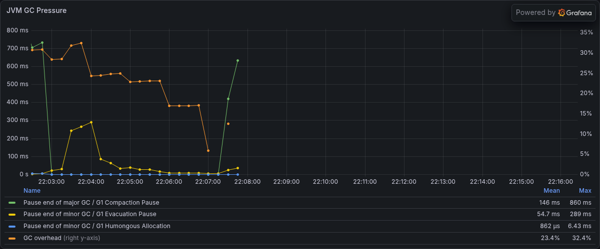 | 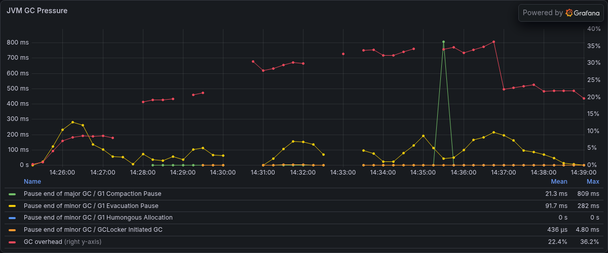 | 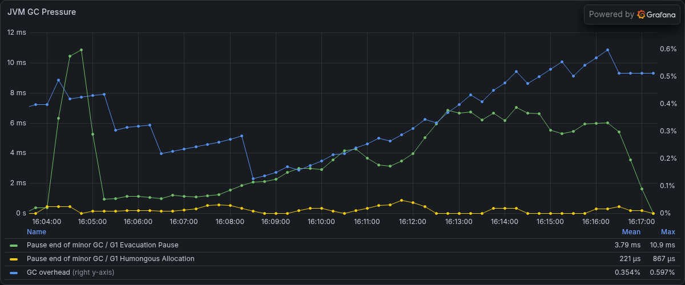 |
| 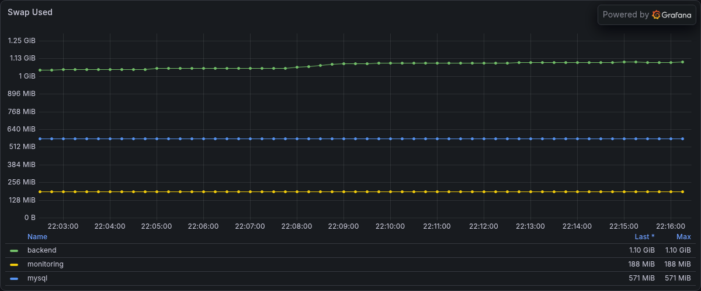 | 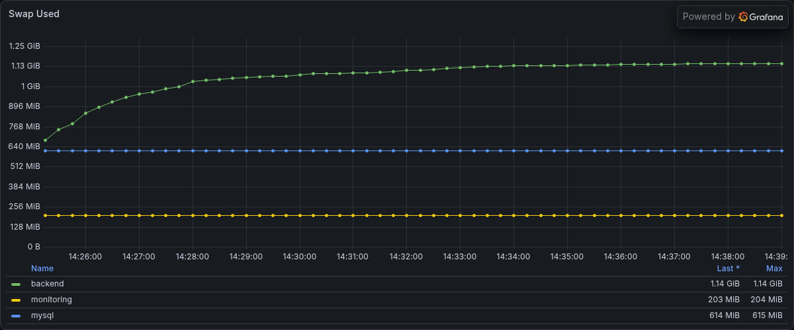 | 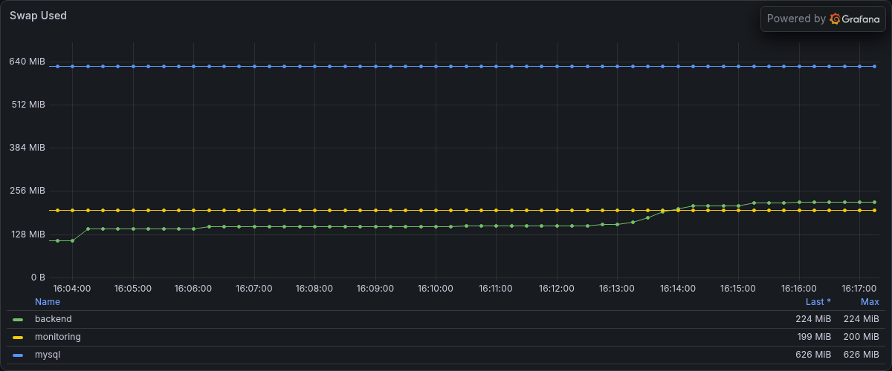 |

---

## 9차 최종 결과 요약

#529(목록 중복 조회 제거) 머지 직후 8차와 동일한 6개 시나리오 표준 세트로 재측정했습니다. 8차(`local-sse,sse-virtual-threads`)와 9차(`redis,sse-virtual-threads`) 모두 가상스레드는 켜져 있고, SSE 처리 방식(JVM 로컬 vs Redis Pub/Sub)만 달라서 완전한 A/B는 아닙니다.

| 구분 | Before | After (9차) |
|---|---|---|
| Hot Auction | MySQL Row Lock 기반 직렬화, p95 52,506ms | Redis Lua 기반 승인, p95 90~140ms |
| DB Connection | Lock 대기로 Pool 포화(30/30) | 입찰 승인 경로에서 DB 제거(10/30 이하) |
| SSE | 전체 Fan-out, 1000 VU에서 연결 성공률 30.6% | 경매 단위 선택 구독, 연결 성공률 100% |
| 목록 조회 p95 | 약 1,100~1,400ms | 약 220~630ms |
| Full GC | 세션당 다수(5·7차) | 0회(8·9차) |

<br/>

<table>
<tr>
<td>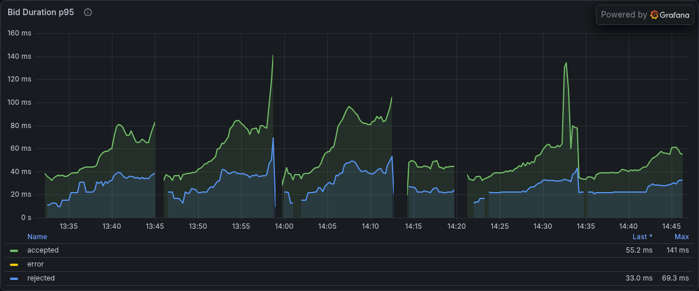</td>
<td>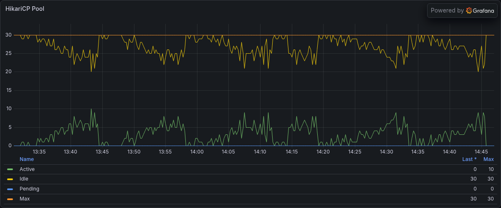</td>
</tr>
<tr>
<td>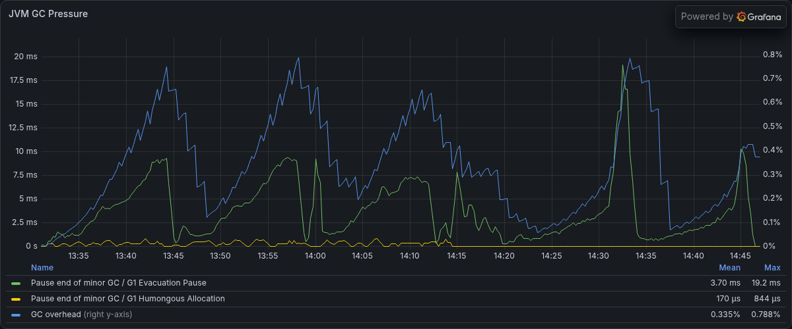</td>
<td>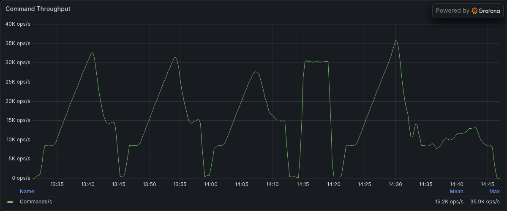</td>
</tr>
</table>

> 상세 부하 테스트 결과는
> [Performance Wiki](https://github.com/softeerbootcamp-8th/WEB-TEAM2-2gether/wiki/6.1-부하-테스트-전략)에서 확인할 수 있습니다.

<br/>

---

# 8. 프로젝트 문서

README에서는 서비스와 핵심 기술만 요약하고,
상세 설계 및 기술적 의사결정은 Wiki에 기록했습니다.

| Category | Documentation |
|---|---|
| 📌 Project | [서비스 소개 / 기획 배경 / 주요 기능](https://github.com/softeerbootcamp-8th/WEB-TEAM2-2gether/wiki/Project-서비스-소개) |
| 📐 Architecture | [전체 시스템 아키텍처 / Backend Architecture / ERD](https://github.com/softeerbootcamp-8th/WEB-TEAM2-2gether/wiki/Architecture-전체-시스템-아키텍처) |
| ⚡ 실시간 경매 시스템 | [입찰 동시성 / Redis Lua 원자적 입찰 / Wallet Hold / Projection](https://github.com/softeerbootcamp-8th/WEB-TEAM2-2gether/wiki/실시간-경매-시스템-경매-및-입찰-정책) |
| 📡 실시간 통신 | [SSE 도입 이유 / Executor 구조 / Virtual Thread](https://github.com/softeerbootcamp-8th/WEB-TEAM2-2gether/wiki/실시간-통신-SSE-도입-이유) |
| 🧠 Redis Architecture | [실시간 상태 원장 / Key 설계 / Cold Seed / Catch-up 검증](https://github.com/softeerbootcamp-8th/WEB-TEAM2-2gether/wiki/Redis-Architecture-실시간-상태-원장) |
| 🚀 Performance | [1~9차 부하 테스트 및 성능 개선](https://github.com/softeerbootcamp-8th/WEB-TEAM2-2gether/wiki/6.1-부하-테스트-전략) |
| 🔐 Authentication | [Redis Session / CSRF / 세션 절대 수명 / 단일 로그인](https://github.com/softeerbootcamp-8th/WEB-TEAM2-2gether/wiki/7.1-인증-구조-변화) |
| 💾 Database & Data | [MySQL Schema / 도메인 모델 / Redis ↔ MySQL 정합성](https://github.com/softeerbootcamp-8th/WEB-TEAM2-2gether/wiki/Database-Data-MySQL-Schema) |
| ☁️ Infrastructure | [AWS 구성 / CI-CD / Monitoring](https://github.com/softeerbootcamp-8th/WEB-TEAM2-2gether/wiki/10.1-AWS-Infrastructure) |
| 🔥 Trouble Shooting | [MySQL filesort / HikariCP 고갈 / Projection 정지 등 11건](https://github.com/softeerbootcamp-8th/WEB-TEAM2-2gether/wiki/Trouble-Shooting-MySQL-filesort-병목) |

<br/>

---

# 9. 팀 소개

## Team 2gether

<table>
<tr>
<th>김현문</th>
<th>이은기</th>
<th>정세호</th>
<th>임하민</th>
</tr>

<tr>
<td align="center">[📷 프로필]</td>
<td align="center">[📷 프로필]</td>
<td align="center">[📷 프로필]</td>
<td align="center">[](https://github.com/haimin13)</td>
</tr>

<tr>
<td align="center">Backend</td>
<td align="center">Backend</td>
<td align="center">Backend</td>
<td align="center">Backend</td>
</tr>

<tr>
<td>
- Auth<br/>
- User<br/>
- Wallet<br/>
- 부하테스트
</td>
<td>
- Auction<br/>
- Bid<br/>
- Redis Lua 기반 원자적 입찰 승인 구현
</td>
<td>
- Card<br/>
- Dashboard<br/>
- Ranking<br/>
- Redis Stream 이벤트 계약 및 배치 영속화
</td>
<td>
- Upload<br/>
- Notification<br/>
- Wishlist<br/>
- SSE
</td>
</tr>
</table>

<br/>

### 협업 방식

- GitHub Issue 기반 작업 관리
- CodeRabbit을 활용한 AI 기반 Code Review
- Daily Scrum
- 기술 조사 및 설계 문서화
- 부하 테스트 결과 공유
- 장애 및 병목 원인 분석 문서화

<br/>

[📷 GitHub Project / Wiki / 팀 활동 이미지]

<br/>

---

<div align="center">

### dbidding

**실시간 경매의 정확성과 확장성을 고민했습니다.**

[Service](https://dbidding.shop)
&nbsp; · &nbsp;
[Wiki](https://github.com/softeerbootcamp-8th/WEB-TEAM2-2gether/wiki)
&nbsp; · &nbsp;
[Repository](https://github.com/softeerbootcamp-8th/WEB-TEAM2-2gether)

</div>