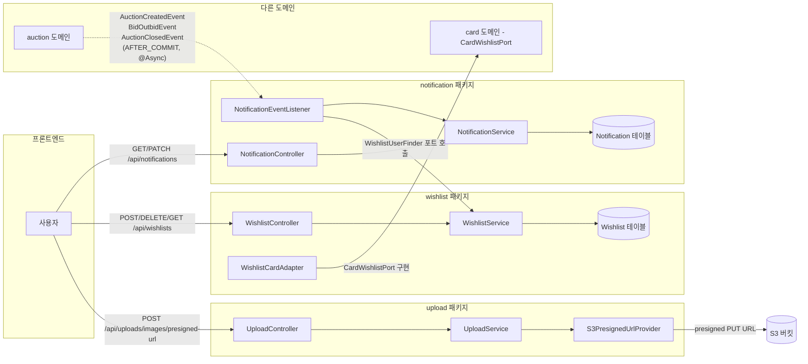
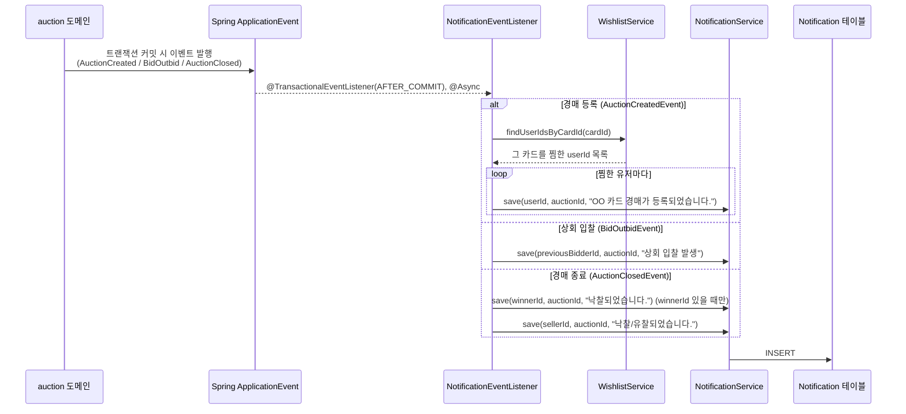
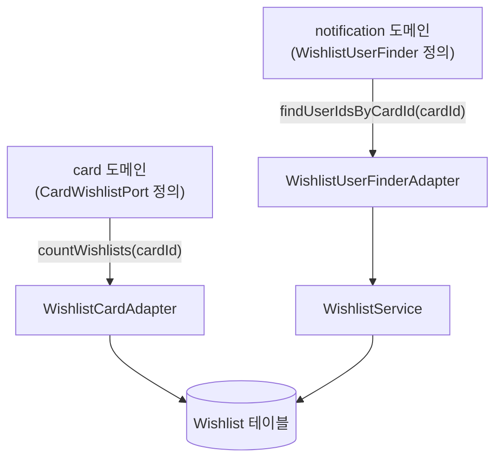
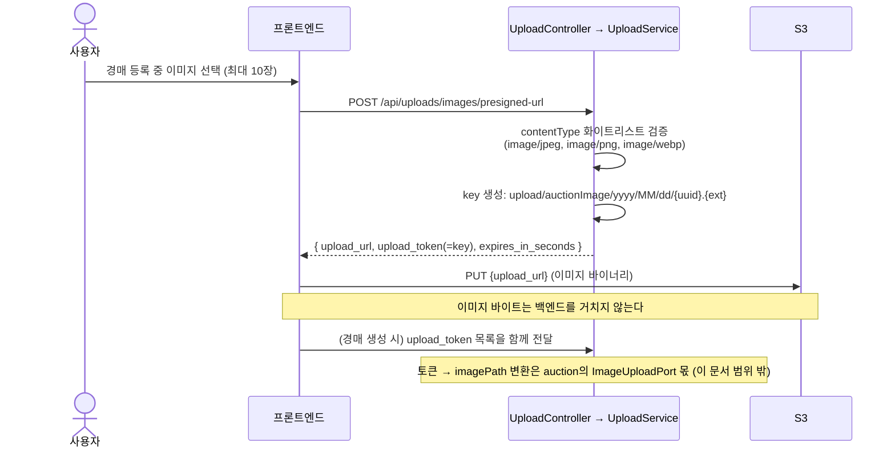

# D(임하민) 담당 영역 개요 — Notification / Wishlist / Upload / Order(1단계)

임하민(D) 담당인 **알림(Notification)**, **찜하기(Wishlist)**, **이미지 업로드(Upload)** 세 도메인과,
팀 논의로 추가 배정받은 **주문(Order) 1단계**의 핵심 흐름과 다른 도메인과의 연동 지점을 정리한다.
각 도메인의 세부 구현 판단은 하위 폴더의 라운드별 문서에서 다루고, 이 문서는 전체 그림과
"왜 이렇게 만들었는지"를 빠르게 파악하기 위한 진입점이다.

## 한눈에 보기

| 도메인 | 역할 | 담당 패키지 | 다른 도메인과의 연결 |
|---|---|---|---|
| Notification | 경매 이벤트를 구독해 알림을 쌓고, 커서 기반 목록/안읽음 개수/읽음 처리 API 제공 | `notification` | `wishlist`(누구에게 보낼지), `auction`(무슨 일이 있었는지, 임시 계약) |
| Wishlist | 카드 찜 추가/해제/목록 조회 | `wishlist` | `card`(찜 개수 집계), `notification`(찜한 유저 조회) |
| Upload | 경매 이미지 업로드용 S3 presigned URL 발급 | `upload` | `auction`(업로드 토큰 → 이미지 경로 변환은 auction 쪽 `ImageUploadPort`, 이 문서 범위 밖) |
| Order (1단계, 신규) | 낙찰 후 구매확정(판매자 정산)/구매취소(구매자 환불) — 배송/반품/수수료는 2단계로 이연 | `order` | `auction`(`AuctionClosedEvent` 구독), `wallet`(정산/환불 — cross-package 협의 필요), `notification`(완료/취소 알림) |

Notification/Wishlist/Upload 세 도메인은 다른 도메인의 Entity/Repository를 직접 참조하지 않고,
**소비자가 정의한 Port를 이 도메인이 구현하는 방식(consumer-owned port)**으로만 연결한다.
Order도 같은 원칙을 따르지만, 정산 로직 자체가 `wallet` 패키지에 없어서 그쪽에 새 메서드가
필요하다 — `order/1-purchase-confirm-cancel-plan.md` 3절 참고.

## 전체 구조

- 화살표의 실선은 API 요청 흐름, 점선은 도메인 이벤트/포트를 통한 비동기·동기 연동이다.
- Upload는 실제 이미지 바이트를 다루지 않는다. presigned URL만 내려주고, 실제 업로드는
  프론트엔드가 S3에 직접 PUT 한다.

---

## 1. Notification — 이벤트 기반 알림

### API

| Method | Path | 설명 |
|---|---|---|
| `GET` | `/api/notifications?cursor=&size=&read=` | 커서 기반 목록 조회 (`read=false`면 안읽음만) |
| `GET` | `/api/notifications/unread-count` | 안읽음 개수 |
| `PATCH` | `/api/notifications/{id}/read` | 단건 읽음 처리 |
| `PATCH` | `/api/notifications/read-all` | 전체 읽음 처리 |

사용자는 `@CurrentUser`(JWT 기반 실제 인증 상태)로 식별한다. 목록은 `id` 내림차순 커서
페이지네이션이며, `size+1`건을 조회해 다음 페이지 존재 여부(`hasNext`)를 판단한다.

### 알림이 쌓이는 흐름

핵심 설계 포인트:

- **AFTER_COMMIT + @Async**: 알림 생성 실패가 경매/입찰 트랜잭션을 롤백시키면 안 되고,
  알림 저장을 기다리느라 원래 요청이 느려져서도 안 된다. 그래서 원본 트랜잭션이 커밋된
  *이후에* 별도 스레드에서 처리한다.
- **임시 이벤트 계약**: `notification/event/*Event`(`AuctionCreatedEvent`,
  `BidOutbidEvent`, `AuctionClosedEvent`)는 auction 담당(이은기)이 실제 이벤트 클래스를
  만들기 전까지 쓰는 임시 계약이다. shape만 맞춰뒀고, 실제 클래스가 생기면 그쪽으로
  교체하고 이 파일들은 삭제한다.
- **WishlistUserFinder 포트**: notification은 wishlist의 Entity/Repository를 직접
  참조하지 않는다. `notification/port/WishlistUserFinder`를 notification이 정의하고,
  `notification/adapter/WishlistUserFinderAdapter`가 `WishlistService`를 감싸서 구현한다.
- **SSE 실시간 푸시는 아직 미구현**: `SseTicketAuthFilter`에 `/api/users/{userId}/notifications/stream`
  경로가 예약되어 있지만, 알림을 실시간으로 밀어주는 SSE 컨트롤러는 아직 없다. 현재
  프론트는 알림 드로어를 열 때마다 목록을 다시 조회하는 방식으로 동작한다.

## 2. Wishlist — 찜하기

### API

| Method | Path | 설명 |
|---|---|---|
| `POST` | `/api/wishlists` `{ "cardId": number }` | 찜 추가 (이미 찜했으면 `409`) |
| `DELETE` | `/api/wishlists/{cardId}` | 찜 해제 |
| `GET` | `/api/wishlists` | 내 찜 목록 조회 |

Notification과 마찬가지로 `@CurrentUser`로 사용자를 식별한다(과거 계획 문서에는
`@PathVariable userId` 방식이 남아있지만, 실제 코드는 이미 JWT 인증 전환이 끝났다).

### 다른 도메인과의 연동

- `card` 도메인이 카드 상세/목록에 찜 개수(`wishlist_count`)를 내려주기 위해
  `CardWishlistPort`를 정의하고, wishlist가 `WishlistCardAdapter`로 구현한다.
- `notification` 도메인이 "이 카드를 찜한 사람 목록"이 필요해서 `WishlistUserFinder`를
  정의하고, wishlist가 `WishlistUserFinderAdapter`로 구현한다.
- 두 경우 모두 wishlist는 자신의 `WishlistService`만 노출하고, 요청하는 쪽이 자기
  패키지 안에 인터페이스(포트)를 두는 방향이라 wishlist 내부 구현(Entity 구조 등)이
  바뀌어도 다른 도메인 코드는 영향받지 않는다.
- (예정) 대시보드(정세호 담당)가 "찜한 카드 목록"을 읽기 위한 `WishlistGateway` 포트가
  설계 문서(`notes/module-interfaces.md`)에 정의돼 있으나 아직 구현 전이다.

## 3. Upload — 이미지 Presigned URL 발급

### API

| Method | Path | 설명 |
|---|---|---|
| `POST` | `/api/uploads/images/presigned-url` | 파일별 `fileName`/`contentType` 목록(최대 10개)을 받아 S3 presigned PUT URL 발급 |

- 백엔드는 AWS 자격 증명을 직접 프론트에 노출하지 않기 위해, "이 경로에만, 몇 분 동안만"
  유효한 서명 URL만 발급한다. 실제 파일 전송은 프론트-S3 사이에서 직접 일어난다.
- `upload_token`은 곧 S3 key이며, 서버가 UUID 기반으로 생성하므로 파일명 충돌·경로
  조작 걱정이 없다.
- 더 자세한 단계별 설명과 Q&A는 [`upload/1-presigned-upload-flow.md`](upload/1-presigned-upload-flow.md),
  [`upload/2-qna.md`](upload/2-qna.md) 참고.

---

## 세부 문서

| 도메인 | 문서 |
|---|---|
| Notification | [엔티티 + 목록조회 골격](notification/1-entity-and-list.md) → [읽음 상태/API 분리/인증 전환](notification/2-read-status-and-navigation.md) → [프론트엔드 연동 계획](notification/3-frontend-integration-plan.md) |
| Wishlist | [프론트엔드 구현 계획](wishlist/1-frontend-implementation-plan.md) |
| Upload | [Presigned 업로드 흐름](upload/1-presigned-upload-flow.md), [Q&A](upload/2-qna.md) |
| Order (1단계) | [구매확정/구매취소 구현 계획](order/1-purchase-confirm-cancel-plan.md) — 설계 배경은 `notes/order-domain-design.md`, 이슈는 [#212](https://github.com/softeerbootcamp-8th/WEB-TEAM2-2gether/issues/212) |

## 참고

- 도메인 간 계약 전체 표는 `notes/module-interfaces.md`, 패키지 배치 원칙은
  `notes/package-structure.md` 참고.
- SSE/실시간 아키텍처 전반(알림 포함)은 `docs/hyeonmoon/realtime/1-sse-architecture.md`에서
  다룬다.

> 이 문서는 claude의 도움을 받아 작성하였습니다.
