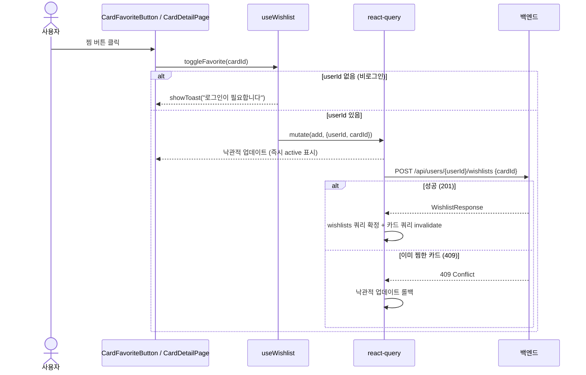

# 위시리스트(찜하기) 프론트엔드 구현 계획

지금까지 프론트엔드의 찜하기 기능은 백엔드 위시리스트 API와 전혀 연결되지 않고, `localStorage`만으로 동작하는 임시 구현이었다. 이 문서는 이를 실제 `wishlist` 도메인 API와 연동하는 작업의 계획을 정리한다.

## 현재 상태

### 백엔드 — `wishlist` 도메인 (이미 구현됨)

`WishlistController` (`/api/users/{userId}/wishlists`, `userId`는 아직 `@PathVariable` — JWT 인증 미들웨어 도입 전 임시 방식):

| Method | Path | 설명 | 응답 |
|---|---|---|---|
| `POST` | `/api/users/{userId}/wishlists` | 찜 추가, body `{ "cardId": number }` | `201` `WishlistResponse` |
| `DELETE` | `/api/users/{userId}/wishlists/{cardId}` | 찜 해제 | `204` |
| `GET` | `/api/users/{userId}/wishlists` | 찜 목록 조회 | `200` `WishlistResponse[]` |

이미 찜한 카드를 다시 추가하면 `409 Conflict`.

### 프론트엔드 — 현재 구현 (`hooks/useCardFavorites.ts`)

- 찜 여부/토글을 전부 `localStorage`(`favorite-card-ids` 키)로만 관리한다. 백엔드 호출이 전혀 없다.
- 같은 브라우저 내 여러 컴포넌트 동기화를 위해 `window` 커스텀 이벤트(`card-favorites-change`)를 사용한다.
- 사용처: `CardFavoriteButton.tsx`(카탈로그 카드의 찜 버튼), `CardsPage.tsx`(찜 필터 "나의 찜"), `CardDetailPage.tsx`(찜 토글 + `wishlist_count` 표시).

### 발견한 이슈 — API 응답 네이밍 불일치

다른 도메인(`card`, `auction`) 응답은 전부 `@JsonProperty`로 `snake_case`를 명시한다 (`market_price`, `card_id` 등). 반면 `WishlistResponse`에는 이 어노테이션이 없어서 자바 필드명 그대로 `cardId`(camelCase)로 내려온다. → **백엔드 `WishlistResponse`에 `@JsonProperty("card_id")`를 추가해 다른 API와 표기법을 통일한다.**

## 결정된 사항

| 항목 | 결정 |
|---|---|
| 기존 localStorage 로직 처리 | 완전히 서버 API 기반으로 교체. 단, `USE_MOCK_API` 로컬스토리지 플래그가 `true`일 때는 (다른 도메인의 `sellApi.ts`와 동일한 패턴으로) 기존 `favorite-card-ids` localStorage 배열을 그대로 재사용해 목업 동작 |
| userId 확보 방식 | 기존 `debugAuthStorage.getDebugUserId()` 재사용. 경매/카드 API처럼 헤더가 아니라 위시리스트는 URL 경로(`/api/users/{userId}/wishlists`)에 넣어야 함 |
| `WishlistResponse` JSON 네이밍 | `@JsonProperty("card_id")` 추가해서 다른 도메인과 통일 |
| 비로그인(`DEBUG_USER_ID` 미설정) 상태에서 찜 버튼 클릭 시 | 확인 버튼이 필요한 `alert`가 아니라, 화면 하단에 잠깐 떴다가 자동으로 사라지는 토스트(스낵바)로 안내. 현재 프로젝트에 토스트 컴포넌트가 없어 신규로 만들어야 함 |

## 변경/신규 파일

### 백엔드

- `backend/src/main/java/com/dbidding/wishlist/dto/WishlistResponse.java` — `cardId` 필드에 `@JsonProperty("card_id")` 추가

### 프론트엔드 — 신규

- `dto/wishlistDto.ts`
  - `WishlistResponseDto { id: number; card_id: number }` (서버 응답 그대로)
  - `WishlistDto { id: number; cardId: number }` (내부 사용, 다른 도메인의 `*ResponseDto`/`*Dto` 분리 패턴과 동일)
- `api/wishlistApi.ts` — `sellApi.ts`와 동일하게 `isMockApiEnabled()`로 분기
  - mock: 기존 `favorite-card-ids` localStorage 배열을 읽고 써서 흉내
  - real: `getDebugUserId()`로 얻은 userId를 경로에 넣어 `request()`로 GET/POST/DELETE 호출. userId가 없으면 에러를 던져 상위(훅)에서 토스트로 처리
- `queries/wishlistQueries.ts` — `wishlistQueries.list(userId)` (`queryOptions`, `queryKey`는 `['wishlists', userId]`)
- `queries/wishlistMutations.ts` — 찜 추가/해제 mutation
  - 성공 시 위시리스트 목록 캐시를 낙관적으로 갱신
  - 카드 목록/상세 쿼리(`cardQueryKeys`)도 invalidate해서 `wishlist_count` 최신화
- `components/Toast.tsx` — 전역 토스트. `useCardFavorites`가 쓰던 것과 같은 커스텀 이벤트 패턴으로 `showToast(message)` 함수를 export하고, `main.tsx`에 `<ToastContainer/>` 한 번만 마운트

### 프론트엔드 — 교체

- `hooks/useCardFavorites.ts` → `hooks/useWishlist.ts`로 대체
  - 외부에 노출하는 반환 형태(`{ favoriteCardIds, toggleFavorite }`)는 그대로 유지해서 사용처 수정을 최소화
  - 내부적으로 `useQuery(wishlistQueries.list(userId))` + mutation으로 동작
  - userId가 없을 때 `toggleFavorite` 호출 시 `showToast('로그인이 필요합니다')` 후 조기 반환
- import 교체 대상: `CardFavoriteButton.tsx`, `CardsPage.tsx`, `CardDetailPage.tsx`

## 시퀀스 (실제 API 모드, 찜 추가)

## 남은 논의/구현 시 확인할 점

- mock 모드와 real 모드 전환 시 로컬스토리지 `favorite-card-ids` 데이터가 서로 공유되지 않는 점은 의도된 동작(모드별로 독립)으로 본다.
- `CardsPage`의 "찜 많은 순"(`FAVORITE`) 정렬과 카드 상세의 `wishlist_count`는 이미 서버가 카드 목록/상세 응답에 포함해서 내려주고 있어(집계는 이 문서의 범위 밖), 프론트는 찜 토글 후 관련 쿼리를 invalidate하는 것만 신경 쓰면 된다.

> 이 문서는 claude의 도움을 받아 작성하였습니다.
